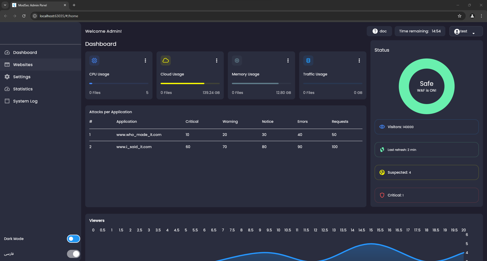

# WaF2Flutter-Interface


A Big journey is just STARTED.
A WAF interface made in Flutter Web is being created!
This project is OPEN SOURCE, means Pull Req is just Open For Who Interested In.

Other information will soon be updated.
```
For installing clone this code via git and run:

flutter create .
```
